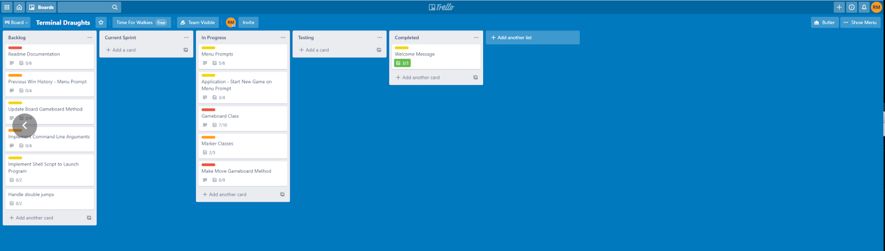

# Terminal Draughts

## **Source Control Repository**

[Link to Github repository](https://github.com/Rhys-Morris/Terminal-Draughts)

## **Software Development Plan**

This application is a programmatic implementation of the two person board game draughts written with the Ruby programming language. It allows two players to engage in a game of draughts via the terminal.

The application utilises external files to store information about player wins, and total wins for each marker colour. This information is accessible within the application to print a formatted leaderboard to the user when requested. The rules of the game are accessible via the application's main menu should a user be unfamiliar with the game of draughts.

This application was designed to be a a recreational aid. The intended audience of this program is anyone who wishes to be entertained. It is perfect for a user who wishes to play a game of draughts with a friend, but does not have access to the board game.

A secondary reason this application was developed was in order to test my learned skills in the Ruby programming language to date, in particular, to expand upon my understanding of Object Oriented Programming and conditional logic.

This program can be launched by a user in two ways: via the `draughts_app.rb` file directly, or via a shell script `draughts.sh`. Command line arguments can be passed to either file to provide helpful information to the user, or to move to specific functionality within the application without accessing the main menu first.

When the application is launched without command line arguments, the user will be presented with a menu of selectable options via keyboard input. This menu was created via the TTY-prompt gem. The menu options are: starting a new game, viewing the leaderboard, viewing how to play instructions and exiting the application. User's are prompted to return to the main menu when they are finished with a particular feature.

## **Application Features**

1. Play a two person game of draughts in the terminal

A new game is started via the main menu. The user will be prompted for the names of the two players prior to starting the game. These names are stored for use on the leaderboard once the game is completed.

The game itself is replete with a full feature set expected of a draughts game including the ability to make multiple jumps and create king markers (markers that can move both forward and backwards).

Players start with twelve markers each, the game ends when a players marker count reaches zero.

The gameboard, current turn and marker counts are printed to the board each turn. A marker to move, and position to move to are selected by the user via keyboard input. If the move is invalid the user is informed and asked to select a new move.

Once a valid move is selected, the board is updated and the current turn switches to the opposing player. This continues until the game ends.

2. View previous game history and total win count for blue versus red

Once a game is completed, the winner of the current game is stored within an external file `./game_history/win_history.txt`. The date of the win is stored alongside the player's name and colour they were playing as. Separately, the total win counts for each playable colour are stored in another external file `./game_history/win_counts.txt`.

The main menu feature 'Display win counts' will parse these files to print out a neatly formatted leaderboard of total player wins. Wins will be sorted in descending order. Total win counts for each colour will also be printed to the terminal.

3. How to play instructions

It is expected that not all users of this application wil have prior experience playing draughts. The 'How to play' menu prompt informs users of the rules of the game.

Once the user has read and understood the rules of the game, they are able to loop back to the main menu via a prompt.

4. Launch new games and previous game history through the terminal via command line arguments

A series of command line arguments have been included to assist user's in navigating the application swiftly, or simply to print further information regarding the application.

Commands included:

- `-h or --help` Display all command line arguments
- `-i or --info` Display instructions on how to play
- `-v or --version` Display current application and Ruby version
- `start` Skip menu and immediately start a new game
- `wins` Print win counts

## Outline of User Interaction

User interaction with the application is handled via keyboard input. The TTY-prompt gem has been used to create a user-friendly main menu for application feature selection. Features are highlighted via the up/down arrow keys and selected with the enter key.

Within the draughts game itself, move selection is also handled through keyboard input. The user is presented a gameboard with marked positions e.g. a1, c7, h4. The user is able to view where markers are positioned on the board, and select a marker to move when prompted. If the marker selected, or move selected, is not valid as per the games rules, the user will be informed of their error and prompted to select again.

The user is constantly informed as to the state of the game after each move via printed terminal output. This includes the current player turn, current marker counts and the gameboard itself.

Errors are, where possible, handled internally within the program so they are not presented to the user. A catch all rescue statement has been included towards the bottom of the call stack with a generic error statement and `exit`. This is to catch any unexpected errors not noticed during development and testing.

Invalid user input has been handled within the application via a combination of conditional while loops and custom exceptions.

## **Control Flow Diagram**

## **Implementation Plan**

Development of this project was managed through Trello. I used colored labels to indicate the expected time commitment for specific tasks. Red indicated a time commitment of 4+ hours, orange 2-4 hours and yellow <1 hour.

Features were broken down into smaller tasks, and even separate cards when it made logical sense to do so. I considered all cards bar the 'Extra Tasks If Time' to be essential to application development. The project would not be considered feature complete until these cards were finished. Minimal viable product was considered to be a working draughts game, without the extra leaderboard and menu features.

The Trello board I used for project management is available to the public here: [Trello Board](https://trello.com/b/2XPubgdp/terminal-draughts). The activity feed can be used to verify consistent use throughout the project.

Trello board in progress shots:

**Testing**:

Testing was split between automated unit tests via Rspec and manual testing. Due to the nature of the project quite a lot of manual testing was required to ensure moves were correctly updating the game state and printing correctly to the terminal. Debugging statements were printed tp the terminal to check internal state when bugs were encountered. I created custom Gameboards to check features such as double jumps, king marker movements and king marker conversions were occurring correctly.

Examples:

Custom board to check correct king marker jumping functionality (two 5 move jumps are possible in this scenario).

Custom board to check double jump feature and correct conversion to king marker.

## **How to Use and Install**

**Requirements**:

Ruby version 2.7.0 or higher

A terminal or terminal emulator.

This application has several Ruby gem dependencies including:

- Rspec
- TTY-prompt
- TTY-progressbar
- Colorize
- Date

A gemlock file is included for ease of dependency installation.

No specific system or hardware requirements are required to run this application.

**Installation**:

To check if you have Ruby already installed use `ruby -v` within your terminal.

For instructions on how to install Ruby on your operating system please follow this [guide](https://www.ruby-lang.org/en/documentation/installation/).

Once Ruby is installed correctly, the next step is to acquire the bundler gem for dependency installation.

This can be achieved in two ways

1. Execute `install.sh` within the application directory. This will install bundler on your machine, and then subsequently install the required gem dependencies for the application.
2. Manual installation:
   - `gem install bundler` within your terminal
   - Navigate to the application directory in your terminal
   - Use the command `gem install` inside this directory to install all gem dependencies

**Running the application**:

The application must be run via the terminal. Navigate to the application directory inside your terminal.

The application can be launched via two ways:

1. Running the command `./draughts.sh` inside the application directory
2. Running the command `ruby draughts_app.rb` inside the application directory

Both commands can be passed an optional command line argument. Only one argument can be passed at a time for reasons of application logic.

Please see above for a list of possible command line arguments.
